# Desafio de Projeto: Construindo seu Primeiro Projeto Lógico de Banco de Dados

Este repositório documenta a resolução do desafio de projeto do Bootcamp "Randstad - Análise de Dados" da DIO, focado na modelagem e implementação de um banco de dados para um cenário de e-commerce.

## 🎯 Descrição do Desafio

O objetivo deste projeto foi aplicar os conceitos de modelagem lógica de banco de dados a partir de um modelo conceitual refinado, com foco em um sistema de e-commerce. As etapas do desafio incluíram:

**1. Modelagem Lógica:**   Refinamento do modelo conceitual para um modelo lógico, considerando as particularidades de um sistema de e-commerce. Isso incluiu a definição de entidades (tabelas), atributos (colunas) e, principalmente, os relacionamentos entre eles, como chaves primárias e estrangeiras. Foram abordados relacionamentos 1:1 (Cliente PF e PJ), 1:N (Um cliente pode ter vários pedidos) e N:N (Um pedido pode ter vários produtos).

**2. Criação do Schema (DDL):** Desenvolvimento do script SQL (Data Definition Language) para a criação do banco de dados ecommerce, incluindo todas as tabelas, suas colunas, tipos de dados e constraints (restrições) como chaves primárias, chaves estrangeiras, AUTO_INCREMENT, ENUM, entre outras.

**3. Persistência de Dados (DML):** Criação de um script para popular as tabelas com dados fictícios. Esta etapa foi crucial para simular um ambiente real e permitir a execução de consultas para validação do modelo.

**4. Execução de Queries Complexas:** Elaboração de uma série de consultas SQL para extrair insights do banco de dados, demonstrando o domínio das seguintes cláusulas e conceitos:

- Recuperações Simples (SELECT): Listagem básica de dados das tabelas.

- Filtros (WHERE): Consulta de dados com base em condições específicas.

- Atributos Derivados: Criação de colunas temporárias para exibir informações calculadas.

- Ordenação (ORDER BY): Organização dos resultados em ordem crescente ou decrescente.

- Agrupamentos com Filtro (HAVING): Aplicação de condições a resultados de funções de agregação (COUNT, SUM, etc.).

- Junções entre Tabelas (JOIN): Combinação de dados de múltiplas tabelas para responder a perguntas mais complexas.

## 🛠️ Ferramenta utilizada

MySQL Workbench 8.0 (diagrama ER)

Link para download: https://www.mysql.com/products/workbench/


## 📊 ETAPAS DO PROJETO

### 1. Modelo Lógica


### 2. Criação do Schema (DDL) 
O script a seguir foi utilizado para criar o banco de dados e as tabelas, definindo a estrutura lógica do projeto de e-commerce:


```ruby
-- CRIAÇÃO DE BANCO DE DADOS PARA ECOMMERCE
CREATE DATABASE ecommerce;
USE ecommerce;

-- FORNECEDOR
CREATE TABLE Fornecedor (
    idFornecedor INT NOT NULL AUTO_INCREMENT,
    razao_social VARCHAR(100),
    cnpj VARCHAR(45),
    telefone VARCHAR(45),
    PRIMARY KEY (idFornecedor)
);

-- PRODUTO
CREATE TABLE Produto (
    idProduto INT NOT NULL AUTO_INCREMENT,
    pnome VARCHAR(100),
    categoria VARCHAR(50),
    descricao VARCHAR(255),
    valor DECIMAL(10,2),
    dimensoes VARCHAR(50),
    avaliacao FLOAT,
    PRIMARY KEY (idProduto)
);

-- TABELA JUNCTION: Fornecedor disponibiliza Produto
CREATE TABLE DisponibilizandoProduto (
    fornecedor_idFornecedor INT NOT NULL,
    produto_idProduto INT NOT NULL,
    PRIMARY KEY (fornecedor_idFornecedor, produto_idProduto),
    CONSTRAINT fk_disp_fornecedor FOREIGN KEY (fornecedor_idFornecedor)
        REFERENCES Fornecedor(idFornecedor) ON DELETE RESTRICT ON UPDATE CASCADE,
    CONSTRAINT fk_disp_produto FOREIGN KEY (produto_idProduto)
        REFERENCES Produto(idProduto)
);

-- ESTOQUE (local físico/depósito)
CREATE TABLE Estoque (
    idEstoque INT NOT NULL AUTO_INCREMENT,
    localizacao VARCHAR(100),
    quantidade INT DEFAULT 0,
    PRIMARY KEY (idEstoque)
);

-- RELAÇÃO ENTRE ESTOQUE E PRODUTO (estoque por produto)
CREATE TABLE Estoque_Produto (
    estoque_idEstoque INT NOT NULL,
    produto_idProduto INT NOT NULL,
    quantidade INT DEFAULT 0,
    endereco VARCHAR(100),
    PRIMARY KEY (estoque_idEstoque, produto_idProduto),
    CONSTRAINT fk_ep_estoque FOREIGN KEY (estoque_idEstoque)
        REFERENCES Estoque(idEstoque) ON DELETE RESTRICT ON UPDATE CASCADE,
    CONSTRAINT fk_ep_produto FOREIGN KEY (produto_idProduto)
        REFERENCES Produto(idProduto) ON DELETE RESTRICT ON UPDATE CASCADE
);

-- TERCEIRO VENDEDOR (vendedor externo)
CREATE TABLE TerceiroVendedor (
    idTerceiroVendedor INT NOT NULL AUTO_INCREMENT,
    razao_social VARCHAR(100),
    nome_fantasia VARCHAR(100),
    endereco VARCHAR(200),
    cnpj VARCHAR(45),
    cpf CHAR(11),
    PRIMARY KEY (idTerceiroVendedor)
);

-- PRODUTOS POR VENDEDOR (Terceiro)
CREATE TABLE ProdutosPorVendedor (
    idProdutoporVendedor INT NOT NULL AUTO_INCREMENT,
    produto_idProduto INT NOT NULL,
    terceiroVendedor_idTerceiroVendedor INT,
    quantidade INT DEFAULT 0,
    PRIMARY KEY (idProdutoporVendedor),
    CONSTRAINT fk_ppv_produto FOREIGN KEY (produto_idProduto)
        REFERENCES Produto(idProduto) ON DELETE RESTRICT ON UPDATE CASCADE,
    CONSTRAINT fk_ppv_terceiro FOREIGN KEY (terceiroVendedor_idTerceiroVendedor)
        REFERENCES TerceiroVendedor(idTerceiroVendedor) ON DELETE SET NULL ON UPDATE CASCADE
);

-- CLIENTE (entidade base)
CREATE TABLE Cliente (
    idCliente INT NOT NULL AUTO_INCREMENT,
    nome_meio VARCHAR(10), -- Alterado para VARCHAR para acomodar 'Ltda.'
    pnome VARCHAR(50),
    sobrenome VARCHAR(50),
    cpf CHAR(11),
    endereco VARCHAR(255),
    email VARCHAR(100),
    telefone VARCHAR(45),
    PRIMARY KEY (idCliente)
);

-- CLIENTE PJ (Pessoa Jurídica) -- ligação 1:1 com Cliente
CREATE TABLE ClientePJ (
    idClientePJ INT NOT NULL AUTO_INCREMENT,
    razao_social VARCHAR(100),
    cliente_idCliente INT NOT NULL,
    cnpj VARCHAR(45),
    inscricao_estadual VARCHAR(50),
    PRIMARY KEY (idClientePJ),
    CONSTRAINT fk_clientepj_cliente FOREIGN KEY (cliente_idCliente)
        REFERENCES Cliente(idCliente) ON DELETE CASCADE ON UPDATE CASCADE
);

-- CLIENTE PF (Pessoa Física) -- ligação 1:1 com Cliente
CREATE TABLE ClientePF (
    idClientePF INT NOT NULL AUTO_INCREMENT,
    nome VARCHAR(100),
    sobrenome VARCHAR(100),
    cliente_idCliente INT NOT NULL,
    data_nascimento DATE,
    PRIMARY KEY (idClientePF),
    CONSTRAINT fk_clientepf_cliente FOREIGN KEY (cliente_idCliente)
        REFERENCES Cliente(idCliente) ON DELETE CASCADE ON UPDATE CASCADE
);

-- ENTREGA
CREATE TABLE Entrega (
    idEntrega INT NOT NULL AUTO_INCREMENT,
    status VARCHAR(45),
    data_envio DATE,
    codigo_rastreio VARCHAR(100),
    data_entrega_prevista DATE,
    data_entrega_realizada DATE,
    PRIMARY KEY (idEntrega)
);

-- PEDIDO
CREATE TABLE Pedido (
    idPedido INT NOT NULL AUTO_INCREMENT,
    status ENUM('PENDENTE','PROCESSANDO','CONFIRMADO','CANCELADO','CONCLUIDO') DEFAULT 'PENDENTE',
    descricao VARCHAR(255),
    cliente_idCliente INT NOT NULL,
    frete DECIMAL(10,2),
    entrega_idEntrega INT,
    PRIMARY KEY (idPedido),
    CONSTRAINT fk_pedido_cliente FOREIGN KEY (cliente_idCliente)
        REFERENCES Cliente(idCliente) ON DELETE RESTRICT ON UPDATE CASCADE,
    CONSTRAINT fk_pedido_entrega FOREIGN KEY (entrega_idEntrega)
        REFERENCES Entrega(idEntrega) ON DELETE SET NULL ON UPDATE CASCADE
);

-- RELAÇÃO ENTRE PRODUTO E PEDIDO (itens do pedido)
CREATE TABLE RelacaoProdutoPedido (
    produto_idProduto INT NOT NULL,
    pedido_idPedido INT NOT NULL,
    quantidade INT DEFAULT 1,
    produto_status ENUM('SOLICITADO','RESERVADO','ENVIADO','ENTREGUE','DEVOLVIDO') DEFAULT 'SOLICITADO',
    PRIMARY KEY (produto_idProduto, pedido_idPedido),
    CONSTRAINT fk_rpp_produto FOREIGN KEY (produto_idProduto)
        REFERENCES Produto(idProduto) ON DELETE RESTRICT ON UPDATE CASCADE,
    CONSTRAINT fk_rpp_pedido FOREIGN KEY (pedido_idPedido)
        REFERENCES Pedido(idPedido) ON DELETE CASCADE ON UPDATE CASCADE
);

-- FORMA DE PAGAMENTO (vinculada ao cliente)
CREATE TABLE FormaDePagamento (
    idFormaDePagamento INT NOT NULL AUTO_INCREMENT,
    tipo ENUM('CARTAO','BOLETO','PIX','DEPOSITO','DOIS_CARTOES') NOT NULL,
    detalhe VARCHAR(255),
    cliente_idCliente INT NOT NULL,
    PRIMARY KEY (idFormaDePagamento),
    CONSTRAINT fk_fp_cliente FOREIGN KEY (cliente_idCliente)
        REFERENCES Cliente(idCliente) ON DELETE CASCADE ON UPDATE CASCADE
);
```

### 3. Persistência de Dados (DML)

Este script foi utilizado para inserir dados fictícios ao banco de dados, criando um ambiente para testes e para consultas futuras.

```ruby
-- Inserindo dados na tabela Fornecedor
INSERT INTO Fornecedor (razao_social, cnpj, telefone) VALUES
('Tech Supplies Ltda.', '11.222.333/0001-44', '(11) 98765-4321'),
('Global Gadgets S.A.', '22.333.444/0001-55', '(21) 98765-5432'),
('Inova Componentes ME', '33.444.555/0001-66', '(31) 98765-6543');

-- Inserindo dados na tabela Produto
INSERT INTO Produto (pnome, categoria, descricao, valor, dimensoes, avaliacao) VALUES
('Smartphone XYZ', 'Eletrônicos', 'Último modelo com câmera de alta resolução.', 2500.00, '15x7x0.8 cm', 4.8),
('Notebook UltraSlim', 'Informática', 'Leve e potente, ideal para trabalho e estudo.', 4500.00, '35x25x1.5 cm', 4.5),
('Fone de Ouvido Bluetooth', 'Acessórios', 'Som imersivo com cancelamento de ruído.', 350.00, '10x8x5 cm', 4.7),
('Teclado Mecânico RGB', 'Informática', 'Teclado gamer com iluminação personalizável.', 550.00, '45x15x4 cm', 4.6),
('Smartwatch FitPro', 'Wearables', 'Monitore sua saúde e receba notificações.', 800.00, '4x4x1 cm', 4.3),
('Cadeira Gamer Ergonômica', 'Móveis', 'Conforto e estilo para longas sessões de jogo.', 1200.00, '70x60x120 cm', 4.9);

-- Associando fornecedores a produtos
INSERT INTO DisponibilizandoProduto (fornecedor_idFornecedor, produto_idProduto) VALUES
(1, 1), -- Tech Supplies Ltda. fornece Smartphone XYZ
(1, 2), -- Tech Supplies Ltda. fornece Notebook UltraSlim
(2, 3), -- Global Gadgets S.A. fornece Fone de Ouvido Bluetooth
(2, 4), -- Global Gadgets S.A. fornece Teclado Mecânico RGB
(3, 5), -- Inova Componentes ME fornece Smartwatch FitPro
(1, 6); -- Tech Supplies Ltda. fornece Cadeira Gamer Ergonômica

-- Inserindo dados na tabela Estoque
INSERT INTO Estoque (localizacao, quantidade) VALUES
('Depósito Central - Prateleira A1', 150),
('Depósito Secundário - Box B3', 80),
('Loja Física - Vitrine 1', 25);

-- Populando a relação Estoque_Produto
INSERT INTO Estoque_Produto (estoque_idEstoque, produto_idProduto, quantidade, endereco) VALUES
(1, 1, 100, 'Prateleira A1.1'), -- 100 Smartphones XYZ no Depósito Central
(1, 2, 50, 'Prateleira A1.2'),  -- 50 Notebooks UltraSlim no Depósito Central
(2, 3, 80, 'Box B3.1'),        -- 80 Fones de Ouvido Bluetooth no Depósito Secundário
(3, 4, 15, 'Vitrine 1.1'),     -- 15 Teclados Mecânicos RGB na Loja Física
(3, 5, 25, 'Vitrine 1.2'),     -- 25 Smartwatches FitPro na Loja Física
(1, 6, 30, 'Prateleira A1.3'); -- 30 Cadeiras Gamer Ergonômicas no Depósito Central

-- Inserindo dados na tabela TerceiroVendedor
INSERT INTO TerceiroVendedor (razao_social, nome_fantasia, endereco, cnpj) VALUES
('Marketplace Online Express', 'Online Express', 'Rua das Vendas, 100 - São Paulo', '44.555.666/0001-77'),
('Vendas Rápidas Ltda.', 'Vendas Rápidas', 'Avenida Comercial, 200 - Rio de Janeiro', '55.666.777/0001-88');

-- Associando produtos a vendedores terceiros
INSERT INTO ProdutosPorVendedor (produto_idProduto, terceiroVendedor_idTerceiroVendedor, quantidade) VALUES
(1, 1, 20), -- Marketplace Online Express tem 20 Smartphones XYZ
(3, 1, 30), -- Marketplace Online Express tem 30 Fones de Ouvido Bluetooth
(2, 2, 10), -- Vendas Rápidas tem 10 Notebooks UltraSlim
(5, 2, 15); -- Vendas Rápidas tem 15 Smartwatches FitPro


--  Clientes (base)
INSERT INTO Cliente (idCliente, nome_meio, pnome, sobrenome, cpf, endereco, email, telefone) VALUES
(1, 'Sr.', 'Ana', 'Silva', '11122233344', 'Rua das Flores, 123 - São Paulo', 'ana.silva@email.com', '(11) 11111-1111'),
(2, 'Sr.', 'Bruno', 'Costa', '22233344455', 'Avenida Principal, 456 - Rio de Janeiro', 'bruno.costa@email.com', '(21) 22222-2222'),
(3, 'Sra.', 'Carla', 'Oliveira', '33344455566', 'Praça Central, 789 - Belo Horizonte', 'carla.oliveira@email.com', '(31) 33333-3333'),
-- Pessoas Jurídicas: criamos o registro base (sem CPF) e depois a tabela ClientePJ conterá o CNPJ
(4, 'Ltda.', 'Comércio Rápido', NULL, NULL, 'Rua do Comércio, 101 - Curitiba', 'contato@comerciorapido.com', '(41) 44444-4444'),
(5, 'S.A.', 'Global Solutions', NULL, NULL, 'Avenida Corporativa, 500 - Porto Alegre', 'adm@globalsolutions.com', '(51) 55555-5555'),
(6, 'ME', 'Pequenos Negócios', NULL, NULL, 'Rua da Inovação, 30 - Recife', 'info@pequenosnegocios.com', '(81) 66666-6666');

-- ClientePF (vinculando os clientes PF aos dados específicos)
INSERT INTO ClientePF (idClientePF, nome, sobrenome, cliente_idCliente, data_nascimento) VALUES
(1, 'Ana', 'Silva', 1, '1985-04-10'),
(2, 'Bruno', 'Costa', 2, '1990-09-20'),
(3, 'Carla', 'Oliveira', 3, '1988-01-30');

--  ClientePJ (vinculando os clientes PJ aos dados específicos)
INSERT INTO ClientePJ (idClientePJ, razao_social, cliente_idCliente, cnpj, inscricao_estadual) VALUES
(1, 'Comércio Rápido Ltda', 4, '12345678000199', 'ISENTO'),
(2, 'Global Solutions S.A.', 5, '98765432000111', '123456789'),
(3, 'Pequenos Negócios ME', 6, '76543210000122', '987654321');

--  Formas de Pagamento (vinculadas ao cliente)
INSERT INTO FormaDePagamento (cliente_idCliente, tipo, detalhe) VALUES
(1, 'CARTAO', 'Visa ****1111'),
(1, 'PIX', 'ana.pix@bank'),
(4, 'DOIS_CARTOES', 'Parcela 1: Visa ****2222 / Parcela 2: Master ****3333'),
(2, 'BOLETO', 'Banco XYZ - 30 dias'),
(5, 'CARTAO', 'Master ****4444');

-- Entrega (pedidos)
INSERT INTO Entrega (idEntrega, status, data_envio, codigo_rastreio, data_entrega_prevista, data_entrega_realizada) VALUES
(1, 'ENVIADO', '2025-09-10', 'BR123456789BR', '2025-09-15', NULL),
(2, 'PENDENTE', NULL, NULL, '2025-09-25', NULL);

--  Pedido (vincula cliente e entrega)
INSERT INTO Pedido (idPedido, status, descricao, cliente_idCliente, frete, entrega_idEntrega) VALUES
(1, 'PROCESSANDO', 'Pedido teste Ana', 1, 15.00, 1),
(2, 'PENDENTE', 'Pedido teste Bruno', 2, 10.00, 2);

--  RelacaoProdutoPedido (itens do pedido)
INSERT INTO RelacaoProdutoPedido (produto_idProduto, pedido_idPedido, quantidade, produto_status) VALUES
(1, 1, 2, 'SOLICITADO'),  -- 2x Camiseta no pedido 1
(2, 1, 1, 'RESERVADO'),   -- 1x Fone no pedido 1
(3, 2, 1, 'SOLICITADO');  -- 1x Boneco no pedido 2
```

### 4. Queries SQL de Análise

As seguintes consultas foram desenvolvidas para extrair informações do banco de dados, para  responder a perguntas de negócio e demonstrar a funcionalidade do esquema.

- Recuperações simples com SELECT

```ruby
-- Listar todos os produtos e seus valores
SELECT idProduto, pnome, valor
FROM Produto;
```

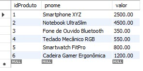


```ruby
-- Listar todos os clientes (Pessoa Física e Jurídica) com seus e-mails:
SELECT pnome, sobrenome, email
FROM Cliente;
```

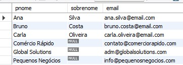

- Filtros com WHERE Statement
  
```ruby
-- Encontrar produtos na categoria 'Eletrônicos':
SELECT pnome, valor
FROM Produto
WHERE categoria = 'Eletrônicos';
```

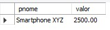


```ruby
-- Listar os pedidos com status 'PROCESSANDO':
SELECT idPedido, descricao, cliente_idCliente
FROM Pedido
WHERE status = 'PROCESSANDO';
```

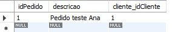


```ruby
-- Encontrar clientes cujo nome começa com a letra 'A':
SELECT pnome, sobrenome
FROM Cliente
WHERE pnome LIKE 'A%';
```

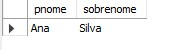


- Criar expressões para gerar atributos derivados

```ruby
-- Calcular o valor total de cada pedido (valor do frete + um valor fixo de R$ 50,00 como taxa de serviço):
SELECT
  idPedido,
  frete,
  (frete + 50.00) AS valor_total
FROM Pedido;
```

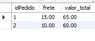

```ruby
-- Exibir o nome do produto e a avaliação com uma descrição (ex.: 'Excelente', 'Bom', 'Regular'):
 SELECT
 avaliacao,
  CASE
    WHEN avaliacao >= 4.5 THEN 'Excelente'
    WHEN avaliacao >= 3.0 THEN 'Bom'
    ELSE 'Regular'
  END AS ClassificacaoAvaliacao
FROM Produto;
```

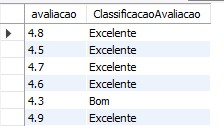


- Ordenações dos dados com ORDER BY

```ruby
-- listar produtos em ordem de valor, do mais caro para o mais barato:
SELECT pnome, valor
FROM Produto
ORDER BY valor DESC;
```

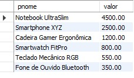


```ruby
-- Listar os fornecedores em ordem alfabética pela razão social:
SELECT razao_social, telefone
FROM Fornecedor
ORDER BY razao_social ASC;
```

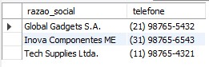


- Condições de filtros aos grupos – HAVING Statemen

```ruby
-- Contar quantos produtos cada fornecedor disponibiliza e listar apenas aqueles que fornecem mais de 1 produto:
SELECT
  F.razao_social,
  COUNT(DP.produto_idProduto) AS TotalProdutos
FROM Fornecedor AS F
JOIN DisponibilizandoProduto AS DP
  ON F.idFornecedor = DP.fornecedor_idFornecedor
GROUP BY
  F.razao_social
HAVING
  TotalProdutos > 1;
```
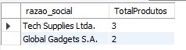


```ruby
-- Encontrar os estoques que têm um total de produtos maior que 50:
SELECT
  E.localizacao,
  SUM(EP.quantidade) AS QuantidadeTotal
FROM Estoque AS E
JOIN Estoque_Produto AS EP
  ON E.idEstoque = EP.estoque_idEstoque
GROUP BY
  E.localizacao
HAVING
  QuantidadeTotal > 50;
```
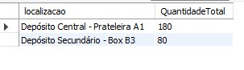


-  Quantos pedidos foram feitos por cada cliente?

```ruby
SELECT 
  c.idCliente,
  CONCAT(COALESCE(c.pnome,''), ' ', COALESCE(c.sobrenome,'')) AS Cliente,
  COUNT(p.idPedido) AS Total_Pedidos
FROM Cliente c
LEFT JOIN Pedido p ON c.idCliente = p.cliente_idCliente
GROUP BY c.idCliente, Cliente
ORDER BY Total_Pedidos DESC;
```

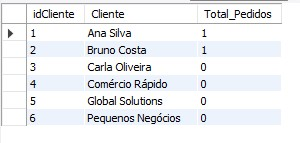

  
- Algum vendedor também é fornecedor?

```ruby
SELECT f.idFornecedor, f.razao_social AS Fornecedor, f.cnpj AS CNPJ,
       tv.idTerceiroVendedor, tv.nome_fantasia AS TerceiroVendedor
FROM Fornecedor f
JOIN TerceiroVendedor tv ON f.cnpj = tv.cnpj;
```

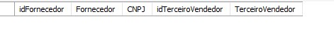


- Qual é a relação de produtos fornecedores e estoques;
```ruby
SELECT 
  p.idProduto,
  p.pnome AS Produto,
  f.idFornecedor,
  f.razao_social AS Fornecedor,
  e.idEstoque,
  e.localizacao AS Estoque_Local,
  ep.quantidade AS Quantidade_no_Estoque,
  COALESCE(ep.endereco, '') AS Endereco_no_Estoque
FROM Produto p
JOIN DisponibilizandoProduto dp ON p.idProduto = dp.produto_idProduto
JOIN Fornecedor f ON dp.fornecedor_idFornecedor = f.idFornecedor
LEFT JOIN Estoque_Produto ep ON p.idProduto = ep.produto_idProduto
LEFT JOIN Estoque e ON ep.estoque_idEstoque = e.idEstoque
ORDER BY p.pnome, f.razao_social, e.localizacao;
```

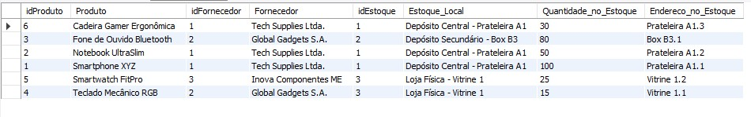


- Qual é a relação de nomes dos fornecedores e nomes dos produtos?

```ruby
SELECT 
  f.idFornecedor,
  f.razao_social AS Fornecedor,
  p.idProduto,
  p.pnome AS Produto
FROM Fornecedor f
JOIN DisponibilizandoProduto dp ON f.idFornecedor = dp.fornecedor_idFornecedor
JOIN Produto p ON dp.produto_idProduto = p.idProduto
ORDER BY f.razao_social, p.pnome;
```

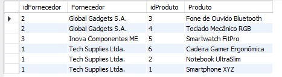
